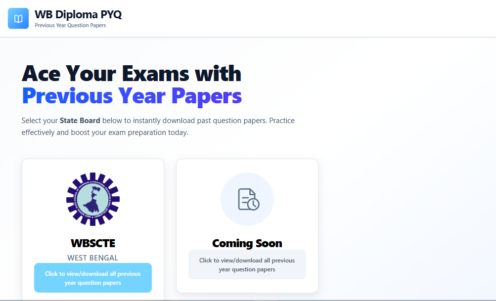
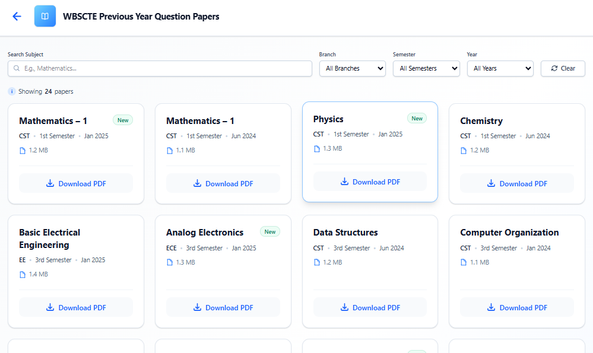

# 📚 ReactJS PYQ Downloader

**A modern, fast, and user-friendly web application built with React to help students easily browse, search, and download Previous Year Question (PYQ) papers.**

[View Live Demo](https://wbscteonline.onrender.com/) 
·
[Report Bug](https://github.com/subrataroy912/reactjs-pyq-downloader/issues)
·
[Request Feature](https://github.com/subrataroy912/reactjs-pyq-downloader/issues)

  
  

---

## 📖 About The Project

Finding previous year's question papers right before exams can be a hassle. **ReactJS PYQ Downloader** solves this problem by providing a centralized, easy-to-navigate interface where students can find their respective university/college PYQs, filter them by semester or subject, and download them in a single click.

### ✨ Key Features

*   **🎓 Course & Semester Filtering:** Seamlessly filter question papers based on specific courses, years, and semesters.
*   **📄 One-Click Download:** Instantly download PYQs in PDF format.
*   **🔍 Search Functionality:** Quickly find specific subjects using the search bar.
*   **📱 Fully Responsive:** Beautiful and functional across all devices (Mobile, Tablet, Desktop).
*   **⚡ Blazing Fast:** Built with React for a smooth, single-page application experience.

---

## 🛠️ Tech Stack

This project is built using modern web development technologies:

*   **Frontend:** React.js
*   **Styling:** Tailwind CSS *(update if you used a specific framework)*
*   **Icons:** React Icons / FontAwesome
*   **Build Tool:** Vite / Create React App

---

## 🗂️ Paper Data

Paper listings are loaded from `public/data/papers.json` at runtime so contributors can add or update papers without editing React component code. Each entry should include:

* `id`, `subject`, `branch`, `semester`, `year`, and `size` for display and filtering.
* `uploadedAt` in `YYYY-MM-DD` format; the app automatically shows the **New** badge for papers uploaded in the last 30 days.
* `downloadLink` with a working hosted paper URL. Do not leave this blank unless the paper is intentionally unavailable; blank links render a disabled **PDF coming soon** button and should not be considered a complete listing.

The current data file uses publicly indexed WBSCTE paper pages as source links. If you add self-hosted PDFs or a backend API later, keep the same JSON field names or update the loader in `src/pages/PyqShop.jsx`.
